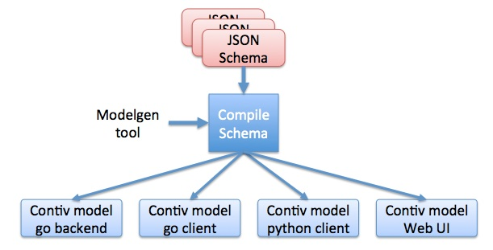
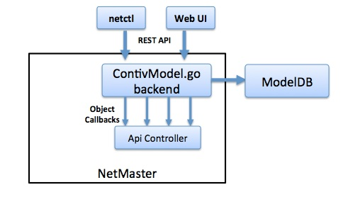

# Object Model
Contiv Object model is defined as a JSON schema (based on http://json-schema.org) and various backend and client libraries are auto generated from the schema.

`modelgen` tool is the schema compiler that generates various backend and client libraries.

## Object model generation


Currently following are generated from the modelgen tool:
 - *Go backend*: This includes the REST API server and object database. This acts as the model and view layers in a model-view-controller architectire.
 - *Web UI*: This includes the javascript views for each object.
 - *Go client*: golang REST client for the objects.
 - *Python client*: python REST client for the objects.

### Adding new object
To add a new object simply create new json file in `contivModel` directory with all necessary attributes(See below for json schema guide) and run following command:
```
objmodel$ make build
```
This will recompile the schema and generate backend and client libraries.
To use the newly generated backend or client library, simply include it in your project

```
import(
    "github.com/contiv/objmodel/contivModel"
    )
```

Note: If you are using godep in your project, you need to godep import the updated library into your project 


### Modifying an existing object
To modify an existing object, just modify the json schema in `contivModel` directory and run:
```
objmodel$ make build
```
this will update the contivModel/contivModel.go and other client libraries.

### Using object model backend
Below is the architecture of contiv model backend as seen by netmaster. In a typical model-view-controller architecture, contivModel acts as the model and view layer. Projects using contiv model only has to write the controller layer.



Auto generated contiv model backend handles the REST APIs, it persists the objects to a distributed KV store(like etcd) and provides callbacks to netmaster's API controller object. API controller object acts as the controller in MVC architecture.

#### Registering for an object
A controller has to register for callbacks for each object it supports. For example, this is how netmaster's controller object registers for callbacks on all objects it supports

```
	// initialize the model objects
	contivModel.Init()

	// Register Callbacks
	contivModel.RegisterGlobalCallbacks(ctrler)
	contivModel.RegisterAppCallbacks(ctrler)
	contivModel.RegisterEndpointGroupCallbacks(ctrler)
	contivModel.RegisterNetworkCallbacks(ctrler)
	contivModel.RegisterPolicyCallbacks(ctrler)
	contivModel.RegisterRuleCallbacks(ctrler)
	contivModel.RegisterServiceCallbacks(ctrler)
	contivModel.RegisterServiceInstanceCallbacks(ctrler)
	contivModel.RegisterTenantCallbacks(ctrler)
```
#### Object Relation management
One of the common problems faced by most backend systems is expressing relation between objects. A relational database is often used in such cases. Distributed KV stores dont provide a good way to express relationship between objects. Objmodel tries to provide a mechanism similar to graph databases using Links and Linksets.

Links are used for heirarchical relations. E.g. `network` belongs to a `tenant` or `rule` belongs to a `policy`

Linksets are used for multi-way relations. E.g `policy` is used by a list of `endpointGroups` or an `app` has a list of `services`

Almost all graph-like relations can be expressed using these two primitives. Links and Linksets are persisted to distributed KV store along with the objects.

#### In memory cache
ContivModel has an in-memory cache of all objects for higher performance. Controller objects can find these objects using Findxxx() function where xxx refers to the object name. Controller objects can also create/delete objects using Createxxx() or Deletexxx() functions. An in-memory cache of Links and Linksets are also kept and can be accessed using same APIs. While modifying objects in cache, its important to remember that any changes to the object *must* be written to persistent store using <object>.Write() function.

### Using go client
Here is an example of how to use contiv go client

```
package main

import (
    "log"

    "github.com/contiv/objmodel/contivModel"
)

func main() {
    client, err := contivModel.NewContivClient("localhost:9999")
    if err != nil {
        log.Fatal(err)
    }
    
    // Define a policy
    policy := contivModel.Policy{
        TenantName: "tenant1",
        PolicyName: "policy",
    }
    
    // Create policy
    err = client.PostPolicy(policy)
    if err != nil {
        log.Errorf("Policy Creation failed. Err: %v", err)
    }
}
```

## Json schema reference
Json schema is defined using multiple `.json` files. Typically one file per object type.
### Schema
Schema is the top level object. This has just one attribute `name` which refers to schema name. A schema has list of `objects`
### Object
Object refers to an a type of REST object.
  - `name`: refers to name of the object type. example `network` or `tenant`.
  - `type`: refers to type of object. only supported type is `object`.
  - `key`: is an ordered list of attribute names that make up the key for an object. E.g. Key for a network object is `tenantName` and `networkName`.
  - `properties`: is the list of fields within the REST object.

### Properties
Property refers to a field in a REST object.
  - `type`: each property can be a `string`, `bool`, `int` or an `array`
  - `title`: is the description for the property. Typically this becomes the field title in a web UI.
  - `description`: is the detailed description for the field. Typically used by tooltips in Web UI.
  - `length`: is the max field length. Typically used for field validation.
  - `min`: Minimum value for the field. used for validation.
  - `max`: Maximum value for the field.
  - `format`: A regex expression for field validation.
  - `default`: Default value in case none was specified.
  - `showSummary`: Show the field in a summary web view.

# Contiv Object Model
This is how current object model looks like:


